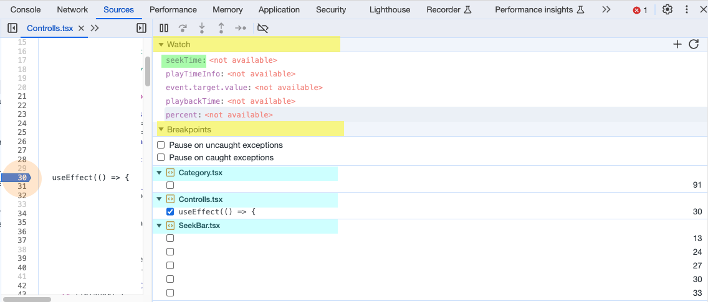
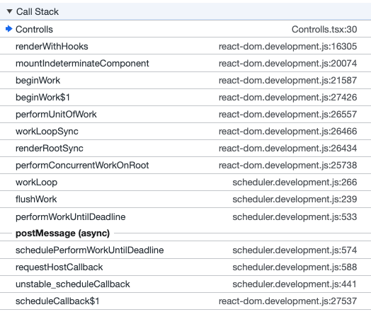

# 1. 어디서 리렌더링이 발생하는지 확인하기  

## 개발자 도구의 중단점(Breakpoints) 활용

✏️ 개발자 도구의 Source 탭에서 Breakpoints(중단점)를 이용해서 어떤 순간에 어느 라인을 실행하는지 체크하자

### 🟠 Breakpoints: 

Breakpoints를 확인하고 싶은 함수 라인을 클릭하고나서 웹을 다시 실행시키거나 해당 함수가 실행되는 행동을 하면 함수 실행 타이밍에 브라우저 잠시 중단됨  

### 🟨 Data taps: 

Breakpoints에 대한 데이터를 볼 수 있는 탭들  

1. Watch: 오른쪽 + 아이콘을 통해 변수명을 입력하면 중단 시점의 변수에 담겨있는 값을 확인할 수 있음  
   🟩 : 확인하고싶은 변수명

2. Breakpoints: 중단점을 한번에 확인할 수 있음, 중단점이 걸린 파일 별로 확인하고 중단점을 해제/등록할 수 있음  
   🟦 : 중단점이 걸린 파일들

3. Scope: 스코프 내에 있는 모든 변수, 객체들의 값을 보여줌  

4. Call Stack: 중단 시점에 실행되는 함수의 call stack을 볼 수 있음. 
    
   리액트 환경일 경우 대부분 react hook으로 스택이 꽉 채워져서 리액트 개발할 때보다는 라이브러리, SDK 소스 확인할 때 Call Stack 탭이 유용했음.

 

# 2. 왜 리렌더링이 발생하는지 확인하기

✏️ 중단점을 걸어놓고 유저 플로우에 따라 서비스를 사용했을 때, '생각지도 못한' 함수가 실행되거나, '이 상황에 필요 없는' 함수가 실행되거나, '너무 자주' 실행되는 경우가 생긴다. 이제 IDE로 넘어와서 해당 함수가 가지고 있는 props, dependency array를 확인하자 

## ① props, dependency Array 확인

리액트 컴포넌트의 라이프 사이클을 보면 (클래스 컴포넌트 기준) 크게 세 가지 타이밍 때 렌더링된다. 

1.  컴포넌트 렌더링(생성) 시
2.  컴포넌트 업데이트 시
    - props가 업데이트 됐을 때
    - state가 업데이트 됐을 때
3.  컴포넌트 렌더링 제외 시

 

주로 2번 사항 때문에 과도한 리렌더링이 발생하는데 props drilling이 있는 상태의 구조라면 부모 컴포넌트가 자신의 state를 업데이트 했을 때 자식 컴포넌트들이 모두 '불필요한' 렌더링을 겪게된다. 

1. props를 전달할 때 '필요할 때' '근접한 거리의' 자식에게만 전달 하도록 하자 

2. props drilling까지 감수해서 전달해야할 props라면 전역 상태 관리 툴을 사용하자. 좋은거 많다. 

3. (본인의 state, 혹은 props가 업데이트 됐을 때 그 변화를 바라보고 함수를 실행시키는 hook인 useEffect를 사용했을 경우에는) useEffect의 dependency Array를 확인하고 불필요한 state가 배열에 들어있지 않은지 체크하고, 삭제할 건 삭제하자. (내 경우에는 이런 경우가 빈번했다.) 

4. 처음부터 불필요한 state 구독이나 props 전달은 지양하자

## ② useMemo 사용

state는 이전과 동일한 값을 넣었을 때는 리렌더링되지 않는다. state 이외에 동일한 계산을 매번 실행하거나, 동일한 값을 사용하는 함수에는 useMemo hook을 사용해주자

 

-

추후에 좋은 방법들을 더 발견하면 추가하도록 하자.
